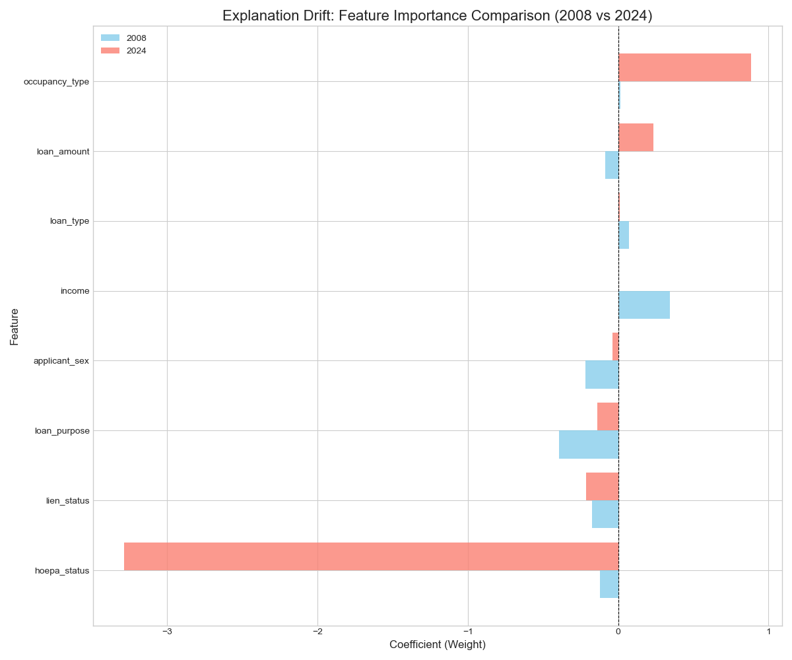

# Statistically Rigorous XAI for Financial Models Under Drift

## 1. Project Goal

This project develops and validates a framework for **statistically rigorous Explainable AI (XAI)** in the context of high-stakes financial models. The central goal is to move beyond standard model explanations by quantifying their statistical uncertainty and systematically detecting **"explanation drift"**—significant changes in a model's decision-making logic over time. By building all machine learning and statistical analysis algorithms from scratch, this work provides a foundational understanding of how to build more trustworthy and reliable AI systems for deployment in dynamic, regulated environments like consumer lending.

---

## 2. Challenges

The primary challenge was analyzing the **Home Mortgage Disclosure Act (HMDA) dataset** from 2008 to 2024. This presented several significant hurdles:
* **Massive Data Volume**: Each yearly file contains millions of rows, with the full dataset exceeding 100 GB. Processing this data required highly memory-efficient wrangling techniques.
* **Inconsistent Data Schemas**: A major regulatory overhaul in 2018 completely changed the data's structure, column names, and feature definitions. A robust schema mapping strategy was required to create a consistent, unified dataset suitable for longitudinal analysis.
* **Data Leakage**: Initial models achieved unrealistic 100% accuracy, which was traced back to data leakage from features like `rate_spread` that are only available post-decision. Identifying and removing these features was critical.
* **Computational Intensity**: The core statistical method, bootstrapping, required training hundreds of models. An initial 12-hour runtime for a single year's analysis was a major bottleneck that necessitated significant code optimization.

---

## 3. Methodology & Core Algorithms

All algorithms were implemented from scratch in Python using only foundational libraries like NumPy and Pandas, based on the mathematical principles from the provided lecture materials.

* **Core Model: Logistic Regression**
    The loan approval status was modeled as a binary classification problem. The logistic regression model uses a **sigmoid function** to map a linear combination of features to a probability:
    $$
    p(y=1 | \mathbf{x}, \beta) = \sigma(\beta^T \mathbf{x}) = \frac{1}{1 + e^{-\beta^T \mathbf{x}}}
    $$
    The model was trained by minimizing the **Negative Log-Likelihood (NLL)** loss function using **Gradient Descent**:
    $$
    \mathcal{L}(\beta) = -\sum_{i=1}^{n} \left[ y_i \log(p_i) + (1 - y_i) \log(1 - p_i) \right]
    $$

* **Statistical Robustness: Bootstrapping**
    To quantify the uncertainty of the model's learned feature importances (the coefficients $\beta$), we used **bootstrapping**. This process involves:
    1.  Creating 100 new datasets by resampling the original data with replacement.
    2.  Training a new logistic regression model on each of these datasets.
    3.  Collecting the learned coefficients ($\beta$) from all 100 models to form a distribution for each feature.
    From these distributions, we calculated the mean, standard deviation, and a 95% confidence interval for each feature's importance.

* **Drift Detection: Welch's t-test**
    To determine if a feature's importance had drifted significantly between two years (e.g., 2008 vs. 2022), we compared their bootstrap distributions. We implemented **Welch's t-test** from scratch to test the null hypothesis that the two distributions have the same mean. A **p-value < 0.05** was used to indicate a statistically significant drift.
    $$
    t = \frac{\bar{X}_1 - \bar{X}_2}{\sqrt{\frac{s_1^2}{N_1} + \frac{s_2^2}{N_2}}}
    $$

---

## 4. Solution & Key Findings

The project successfully developed a complete, end-to-end pipeline to analyze explanation drift. The data wrangling challenges were overcome by creating specialized, memory-efficient data loaders and a schema mapping strategy. The computational bottleneck of bootstrapping was solved by training on smaller, random subsamples.

The final analysis produced a clear narrative of how the lending model's logic evolved from 2008 to 2024:

* **Post-Crisis Volatility (2008-2012)**: The model's logic was highly volatile, with the importance of key features like `loan_amount` and `occupancy_type` reversing their roles entirely as the market reacted to the financial crisis.
* **Period of Stabilization (2013-2017)**: The model's logic began to stabilize, with an increasing number of features showing no significant year-over-year drift. `Income` became the most dominant positive predictor of loan approval.
* **Schema Change Shock (2017-2018)**: A major regulatory change to the HMDA data collection resulted in a massive, statistically significant drift across every single feature, forcing the model to learn a fundamentally new logic.
* **The "New Normal" (2019-2024)**: In the most recent period, the model's logic has reached a high degree of stability. Key financial indicators like `income` and risk factors like `hoepa_status` now show no significant drift, indicating a mature and consistent lending environment as interpreted by the model.

This project successfully demonstrates a robust, statistically grounded method for monitoring the explanations of machine learning models over time, providing a critical tool for ensuring the reliability and trustworthiness of AI in finance.

### Example Visualization: Explanation Drift (2008 vs 2024)

