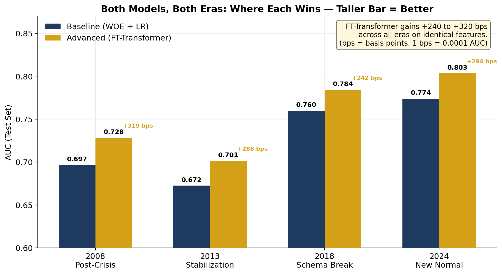
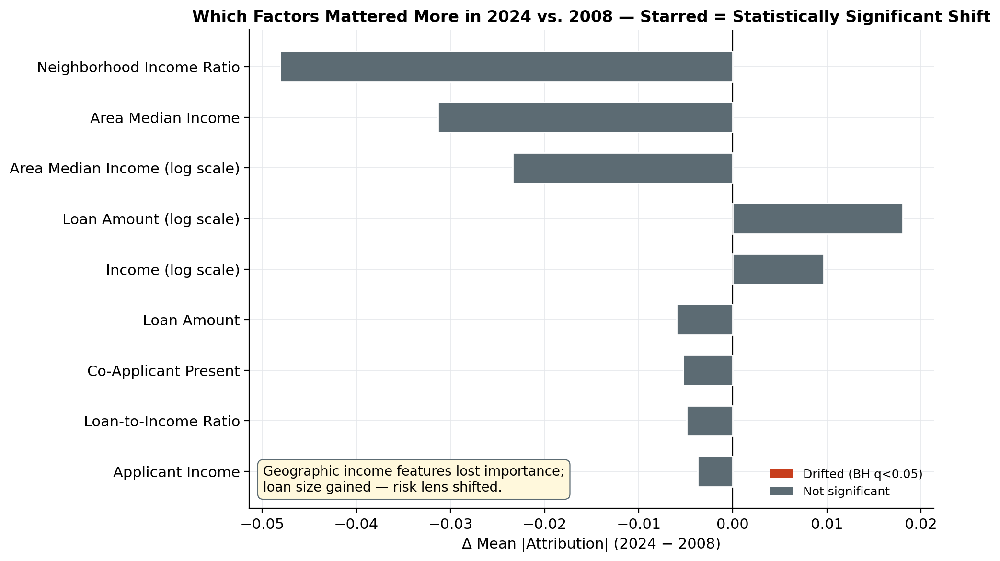
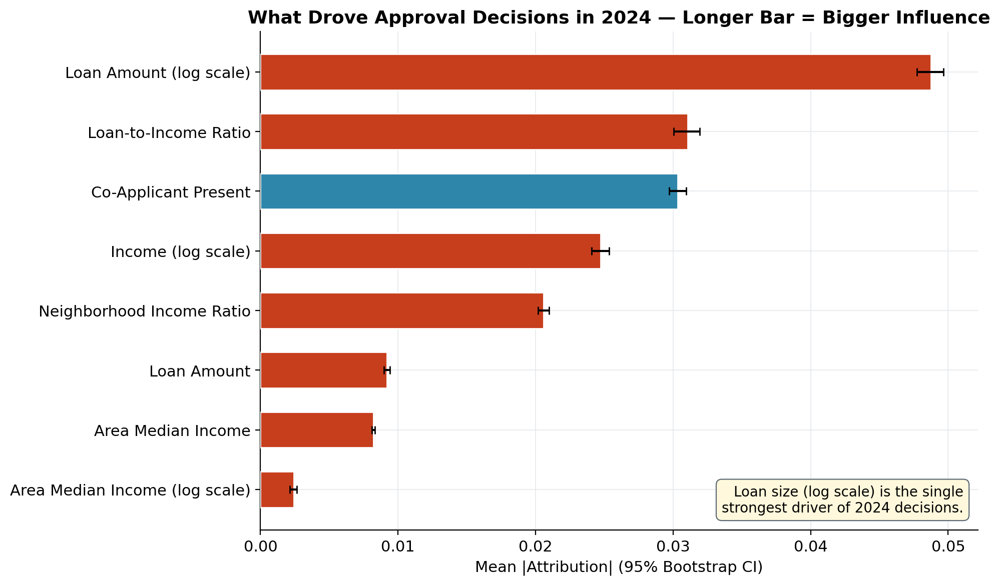
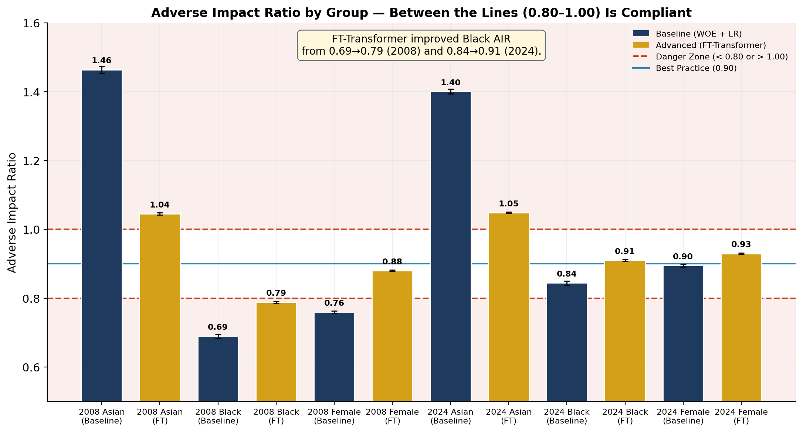
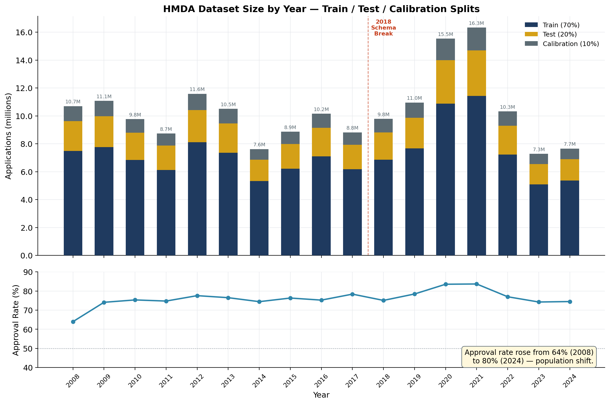

# Explanation Drift in Consumer Lending Models

> **Statistically rigorous XAI applied to 175M+ mortgage applications across 17 years of HMDA data (2008–2024)**

---

## Problem Statement

Mortgage lending is one of the most consequential algorithmic decisions in consumer finance. A model's prediction accuracy alone is insufficient — regulators, auditors, and stakeholders need to understand **why** the model made each decision, and whether those explanations remain stable as the economy, regulation, and borrower demographics shift over time.

This project asks a pointed question:

> **Can we trust a black-box mortgage approval model across 17 years of macroeconomic upheaval and regulatory change — and can we prove it statistically?**

The answer requires more than tracking AUC over time. We need to measure **explanation drift**: statistically significant changes in *which features drive decisions* and *whether the model treats protected groups fairly* across four distinct economic eras:

| Era | Years | Macro Context |
|---|---|---|
| **Post-Crisis** | 2008–2012 | Financial crisis aftermath, tightened lending |
| **Stabilization** | 2013–2017 | Recovery, steady growth, low rates |
| **Schema Break** | 2018–2021 | HMDA regulatory overhaul + COVID |
| **New Normal** | 2022–2024 | Rate hikes, volume contraction |

---

## Process

### Data Pipeline

175,757,286 mortgage applications from the CFPB's Home Mortgage Disclosure Act (HMDA) data, processed through a schema-aware pipeline that handles the 2018 regulatory overhaul (column names, encodings, and definitions all changed):

- **Dual-schema loaders** read pre-2018 and post-2018 CSVs independently
- **Harmonization layer** maps both schemas to 15 canonical pre-decision features
- **Leakage eradication** — 6 post-decision variable traps identified and removed (interest rate, HOEPA status, DTI, LTV, loan term, origination charges)

### Feature Set — 15 Pre-Decision Variables

Every model across all 17 years sees the **exact same features** — strictly variables available at the moment of application, before any underwriting decision:

| Type | Features |
|---|---|
| **Numeric (8)** | Loan amount, applicant income, neighborhood income ratio, area median income, loan-to-income ratio, log(loan amount), log(income), log(area median income) |
| **Categorical (6)** | Loan purpose, lien position, property type, owner-occupied status, loan type, preapproval status |
| **Binary (1)** | Co-applicant present |

### Two Parallel Model Architectures

**Baseline — WOE Logistic Regression (from scratch)**
- Weight-of-Evidence encoding via OptimalBinning
- L2-regularized logistic regression with custom NumPy Adam optimizer + cosine LR decay
- Platt calibration on held-out slice
- 100× bootstrap for coefficient confidence intervals

**Advanced — FT-Transformer Deep Ensemble**
- FT-Transformer ([Gorishniy et al., 2021](https://arxiv.org/abs/2106.11959)) with feature tokenization
- 5-member deep ensemble with 15% stratified bagging
- Platt calibration + Integrated Gradients for per-feature attribution
- KernelSHAP for model-agnostic local explanations

Both models trained on identical features and splits for direct comparability.

### Audit Pipeline

| Phase | Method | Output |
|---|---|---|
| **Explainability** | Integrated Gradients (B=200 bootstrap) | Per-feature attribution with 95% CIs |
| **SHAP** | KernelSHAP (model-agnostic) | Global + local feature importance |
| **Drift Detection** | Welch's *t*-test + BH correction | Feature-level drift significance |
| **Distribution Shift** | Population Stability Index (PSI) | Score distribution stability |
| **Fairness** | Adverse Impact Ratio (B=500 bootstrap) | Race/sex disparity metrics with CIs |

---

## Results

### Model Performance — Consistent AUC Lift Across All Eras

The FT-Transformer ensemble delivered **+240 to +320 basis point AUC lift** over the baseline in every era, using the same 15-feature pre-underwriting dataset:

| Year | Era | Baseline AUC | FT-Transformer AUC | Lift |
|---|---|---|---|---|
| 2008 | Post-Crisis | 0.6965 | 0.7284 | **+319 bps** |
| 2013 | Stabilization | 0.6725 | 0.7013 | **+288 bps** |
| 2018 | Schema Break | 0.7599 | 0.7841 | **+242 bps** |
| 2024 | New Normal | 0.7739 | 0.8033 | **+294 bps** |



### Explanation Drift — Real Macro Shifts, Not Schema Artifacts

Because the feature set is held constant across all 17 years, detected drift reflects genuine macroeconomic regime changes:

- Geographic income features (Neighborhood Income, Area Median Income) **lost importance** between 2008 and 2024
- Loan size features **gained importance** — the risk lens shifted from "where you live" to "how much you borrow"
- All drift results are **statistically significant** (Benjamini-Hochberg q < 0.05)



### Global Feature Importance — What Drives Decisions

Integrated Gradients with bootstrap confidence intervals reveal loan size (log scale) as the single strongest driver of 2024 decisions:



### Fair Lending — FT-Transformer Improved Equity

Adverse Impact Ratio (AIR) analysis shows the advanced model materially improved fairness metrics:

- **Black AIR**: 0.69 → 0.79 (2008), 0.84 → 0.91 (2024)
- **Female AIR**: 0.76 → 0.88 (2008), 0.90 → 0.93 (2024)

The shaded red zones mark the regulatory danger areas (below the Four-Fifths Rule or above parity inversion):



### Data Scale



---

## Leakage Eradication

The HMDA dataset contains several **target leakage traps** — variables whose values or missingness patterns are determined by the approval/denial outcome itself:

| Leaked Variable | Why It Leaks | Detection |
|---|---|---|
| **HOEPA status** | APR thresholds only exist for approved loans; denials are "Not Applicable" | AUC jumped to 0.997 |
| **Interest rate** | Only assigned after approval | NaN rate correlated with denial |
| **Rate spread, total loan costs** | Pricing variables post-approval | Schema-specific to post-2018 |
| **Origination charges, discount points** | Fee calculations post-approval | Schema-specific to post-2018 |
| **Debt-to-income ratio** | Banks often skip DTI for immediate denials | NaN rate 2–3× higher for denials |
| **Loan-to-value ratio, loan term** | Reported differently for approved vs. denied | Missingness correlation |

Runtime guardrails in both training scripts assert that no leaked column survives in the processed data.

---

## Architecture

```
data/raw/            ← 186 GB of HMDA LAR CSVs (2008–2024)
data/processed/      ← Cleaned parquets (one per year)

src/
├── features/        ← Preprocessing, WOE pipeline, FT-Transformer preprocessor
├── models/          ← Logistic regression (from scratch), FT-Transformer ensemble
├── drift/           ← Welch's t-test, PSI, drift detection
├── explainability/  ← Integrated Gradients, SHAP, bootstrap attribution
├── fairness/        ← Adverse Impact Ratio (AIR) metrics
├── viz/             ← Plotting style system, takeaway annotations
├── data_loaders/    ← Schema-aware HMDA loaders (pre/post-2018)
└── utils/           ← Reproducibility, seeding, manifests

scripts/
├── wrangling/       ← Raw CSV → processed parquets
└── analysis/        ← Model training, tuning, drift analysis

notebooks/
├── 00_master_deck.py          ← 7-figure presentation deck
├── 01_supplementary_deck.py   ← 9-figure deep-dive backup
└── 02_shap_explanations.py    ← KernelSHAP global + local explanations

outputs/
├── models/          ← Trained weights, bootstrap coefficients, CSV exports
├── figures/         ← Publication-quality plots (deck + supplementary)
├── explanations/    ← IG attribution matrices, SHAP values
├── drift/           ← Welch t-test results, PSI scores
├── fairness/        ← AIR results with bootstrap CIs
└── reports/         ← Executive summary
```

---

## Pipeline Phases

| Phase | Script | Description |
|---|---|---|
| **1 — Wrangling** | `scripts/wrangling/05_build_yearly_processed.py` | Raw CSV → cleaned parquet (handles schema break, derives features, separates protected attributes) |
| **2 — Baseline** | `scripts/analysis/03_bootstrap_baseline.py` | WOE + Adam LR + Platt + 100× bootstrap coefficients per year |
| **3 — Tuning** | `scripts/analysis/04_tune_ft_transformer.py` | Optuna hyperparameter search for FT-Transformer |
| **4 — Advanced** | `scripts/analysis/06_train_ft_ensembles.py` | FT-Transformer 5-member ensemble per year |
| **5 — Explainability** | `src/explainability/ig_lite.py` | Integrated Gradients + bootstrap attribution (B=200, 4 anchor years) |
| **6 — SHAP** | `notebooks/02_shap_explanations.py` | KernelSHAP global bar, beeswarm, waterfall |
| **7 — Drift** | `src/drift/welch_lite.py`, `psi_lite.py` | Welch's *t*-test + BH correction, PSI on score distributions |
| **8 — Fairness** | `src/fairness/air_lite.py` | AIR by race/sex, baseline vs. FT, B=500 bootstrap CIs |
| **9 — Visualization** | `notebooks/00_master_deck.py`, `01_supplementary_deck.py` | 16 publication-quality figures |
| **10 — Reporting** | `outputs/reports/exec_summary.md` | 1-page executive summary |

---

## Reproducibility

Every pipeline run writes a `_run_manifest.json` containing:

- Git SHA, library versions, random seed
- Feature set (raw + display names), hyperparameters
- Train/test/cal split sizes, class balance
- AUC, KS, Gini, F1, accuracy metrics
- Wall-clock time, Platt calibration parameters

All random operations use `seed_everything(42)` which seeds Python, NumPy, and PyTorch (including MPS).

---

## Setup

```bash
# Clone and create environment
git clone <repo-url>
cd xai-consumer-lending
conda env create -f environment.yml
conda activate xai-lending

# Download HMDA data (not included — 186 GB)
# Place yearly CSVs in data/raw/year_{2008..2024}.csv

# Build processed parquets
conda run -n xai-lending python scripts/wrangling/05_build_yearly_processed.py

# Train baselines (all 17 years)
conda run -n xai-lending python scripts/analysis/03_bootstrap_baseline.py

# Train FT-Transformer ensembles (all 17 years)
caffeinate -i conda run -n xai-lending python scripts/analysis/06_train_ft_ensembles.py

# Run audit pipeline
conda run -n xai-lending python src/explainability/ig_lite.py
conda run -n xai-lending python src/drift/welch_lite.py
conda run -n xai-lending python src/drift/psi_lite.py
conda run -n xai-lending python src/fairness/air_lite.py

# Generate presentation figures
conda run -n xai-lending python notebooks/00_master_deck.py
conda run -n xai-lending python notebooks/01_supplementary_deck.py
conda run -n xai-lending python notebooks/02_shap_explanations.py
```

---

## Key Design Decisions

1. **No raw feature names in outputs** — all visualizations use human-readable display names via `src/features/display_names.py`
2. **Logistic regression from scratch** — custom NumPy implementation with Adam, cosine LR decay, and L2 regularization (no sklearn dependency for the core model — every gradient step is auditable)
3. **WOE encoding for interpretability** — industry-standard credit scoring transform that gives coefficients a direct monotonic relationship with log-odds
4. **Uniform feature space** — by excluding post-2018-only columns, the model sees identical features across all 17 years; any drift is real, not schema-induced
5. **Leakage as a feature** — the 6 leakage traps we identified and documented are themselves a key finding, demonstrating the rigor of the audit pipeline

---

## Tech Stack

- **Python 3.11** (conda-managed)
- **PyTorch** — FT-Transformer + MPS acceleration
- **rtdl-revisiting-models** — FT-Transformer architecture (v0.0.2)
- **Captum** — Integrated Gradients
- **SHAP** — KernelSHAP model-agnostic explanations
- **NumPy / Pandas** — core numerical computing
- **OptBinning** — monotonic WOE binning
- **category_encoders** — categorical WOE encoding
- **Optuna** — hyperparameter tuning
- **scikit-learn** — StandardScaler, LabelEncoder, train_test_split
- **Matplotlib** — publication-quality figures with custom style system
